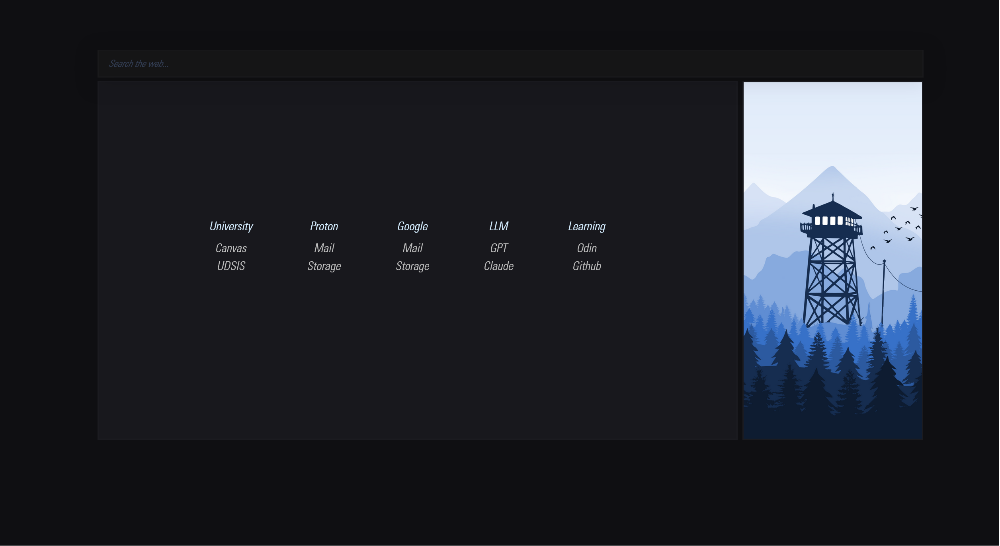

# Startpage

A clean, customizable browser startpage with configurable navigation links, search functionality, and responsive design.

## Features

- Customizable navigation categories and links
- Responsive design that scales to fit your screen
- Live clock with date and time
- Clean, modern interface
- Google search integration
- Easy configuration through a single config file

## Customization

The startpage can be easily customized by editing the `js/config.js` file:

1. Add or modify navigation categories
2. Change link destinations
3. Update colors and theme
4. Configure custom font

## Development

This project uses:
- HTML5 for structure
- CSS3 for styling
- JavaScript for functionality
- CSS variables for theming